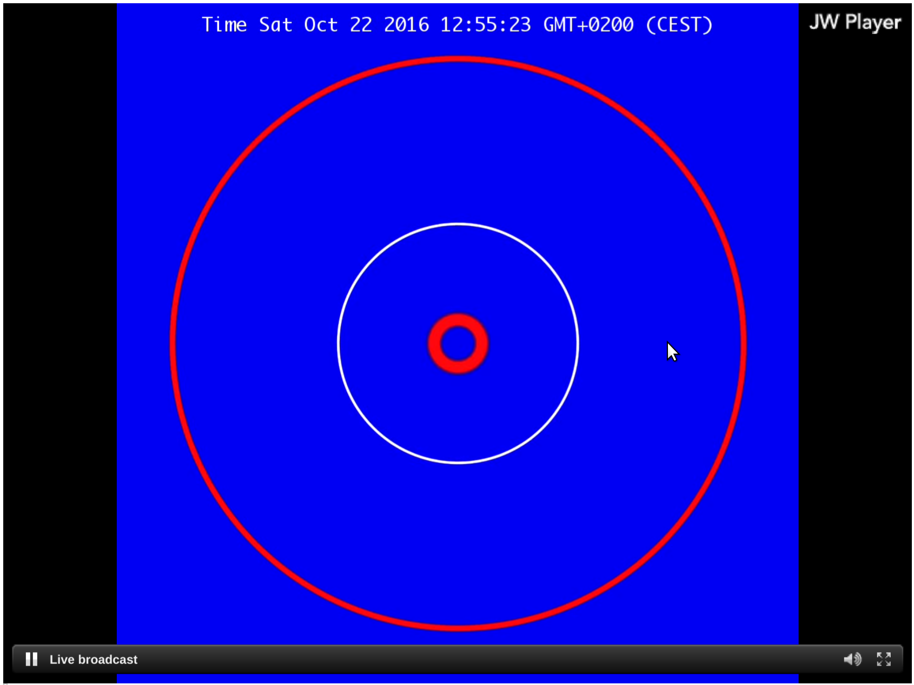

.. _getting_started:

Hello world
===========

Generating a video
------------------

This manual is going to assume ``starcry`` is already present on the system.

If you don't want to install it, you can also use ``docker`` by defining the following alias:

::

    alias starcry='docker run -it -v `pwd`:`pwd` -w `pwd` rayburgemeestre/starcry:latest'

The docker image is very light-weight and takes only about +/- 58 MiB of disk space.

Create a new file ``hello_world.js`` and save to it the following content.

.. highlight:: javascript
.. literalinclude:: examples/hello_world.js

From the commandline you can invoke the following command.

::

    starcry hello_world.js            # generates video to output.h264
    starcry hello_world.js test.h264  # explicitly specify the output filename

In the current directory this will generate the video file ``output.h264``.
Use for example ``ffplay`` or ``mpv`` or ``mplayer`` to view it.

::

    mpv output.h264

The result should look like the following animated gif.

Other useful options are:

::

    starcry hello_world.js --gui       # will also show a preview window
    starcry hello_world.js --gui-only  # will only show the rendering on the preview window

Interactive mode
----------------

.. highlight:: bash
::

    starcry -i     # interactive mode
    starcry -i -v  # interactive mode + cli visualisation enabled

The UI will be viewable at http://localhost:18080/websock/

This UI is a work in progress.

Using HLS streaming
-------------------

We will use the provided example ``clock.js`` and demonstrate how to use streaming instead of generating a video.

.. highlight:: javascript
.. literalinclude:: ../input/clock.js

From the commandline you can invoke the following command.

.. highlight:: bash
::

    starcry --stream clock.js

The stream will be viewable at http://localhost:18080/stream.html

