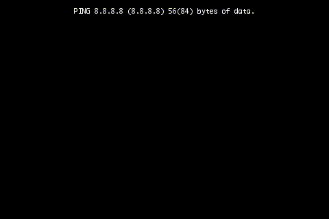

.. _getting_started:

Hello world
===========

Depending on your intended use case different *Hello world*'s may be applicable. We'll start with the most basic one.

Generating a video
------------------

This manual is going to assume starcry is already present on the system.

Create a new file ``hello_world.js`` and save to it the following content.

.. highlight:: javascript
.. literalinclude:: examples/hello_world.js

From the commandline you can invoke the following command.

::

    starcry hello_world.js

In the current directory this will generate the video file ``output.h264``.
Use for example ``ffplay`` to view it.

::

    ffplay output.h264

The result should look like the following animated gif.

.. image:: output.gif

Alternatively you can instead view the rendering in realtime without producing the video.
However this script will not take long to render.

::

    starcry hello_world.js --gui --no-video-output

Using standard input
--------------------

Create a new file ``hello_world2.js`` and save to it the following content.

.. highlight:: javascript
.. literalinclude:: examples/hello_world2.js

From the commandline you can invoke the following command.

::

    ping -c 75 8.8.8.8 | starcry hello_world2.js --gui

The result should look like the following animated gif.

