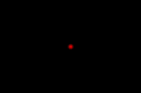

.. _javascript_api:

Scripting API
=============

Starcry will read all instructions from a Javascript file which is passed as a commandline argument, i.e. ``starcry script.js``.
Let's start with a simple example.

Available global variables
--------------------------

+---------------------------------+----------+-------------------------------------------------------------------------+
| **Read-only variable**          | **Type** | **Description**                                                         |
+=================================+==========+=========================================================================+
| ``current_frame``               | integer  | Auto incremented number indicating the current frame (starts at 0)      |
+---------------------------------+----------+-------------------------------------------------------------------------+
| **Exported variables**          | **Type** | **Description**                                                         |
+---------------------------------+----------+-------------------------------------------------------------------------+
| ``canvas_w``                    | integer  | Specified target width of the video to be generated.                    |
+---------------------------------+----------+-------------------------------------------------------------------------+
| ``canvas_h``                    | integer  | Specified target height of the video to be generated.                   |
+---------------------------------+----------+-------------------------------------------------------------------------+
| ``fps``                         | integer  | Number of frames per seconds to be used rendering the video.            |
+---------------------------------+----------+-------------------------------------------------------------------------+
| ``max_frames``                  | integer  | Maximum number of frames to render (duration of video).                 |
+---------------------------------+----------+-------------------------------------------------------------------------+
| ``bitrate``                     | integer  | Bitrate specified in bits per second (*i.e.*, 500 kB/sec = 500*1024*8). |
+---------------------------------+----------+-------------------------------------------------------------------------+
| ``stdin``                       | boolean  | Input from standard input (stdin) is used by this script.               |
+---------------------------------+----------+-------------------------------------------------------------------------+
| ``scale``                       | float    | Scale factor to apply (useful for resizing everything proportionally)   |
+---------------------------------+----------+-------------------------------------------------------------------------+
| ``realtime``                    | boolean  | W.I.P: To be used for writing at a controlled/fixed FPS.                |
+---------------------------------+----------+-------------------------------------------------------------------------+

Implementable functions
-----------------------

+---------------------------------+-----------------+----------------------------------------------------------------------------+
| **Function signature**          | **Return type** | **Description**                                                            |
+=================================+=================+============================================================================+
| initialize ()                   | void            | Invoked at the beginning (optionally implement)                            |
+---------------------------------+-----------------+----------------------------------------------------------------------------+
| next ()                         | void            | Invoked when input for a new frame is needed.                              |
+---------------------------------+-----------------+----------------------------------------------------------------------------+
| input (string line)             | void            | Invoked when line of input is available from stdin.                        |
+---------------------------------+-----------------+----------------------------------------------------------------------------+

Available global functions
--------------------------

+--------+-----------------------------------------------------------------------------------------------------------------------+
| Return | **General functions**                                                                                                 |
+========+=======================================================================================================================+
| float  | version_ ()                                                                                                           |
+--------+-----------------------------------------------------------------------------------------------------------------------+
| void   | output_ (string line)                                                                                                 |
+--------+-----------------------------------------------------------------------------------------------------------------------+
| void   | set_background_color_ (color_ color)                                                                                  |
+--------+-----------------------------------------------------------------------------------------------------------------------+
| void   | add_text_ (pos_ pos, double size, string text, string align)                                                          |
+--------+-----------------------------------------------------------------------------------------------------------------------+
| void   | add_circle_ (circle_ circle)                                                                                          |
+--------+-----------------------------------------------------------------------------------------------------------------------+
| void   | add_line_ (line_ line)                                                                                                |
+--------+-----------------------------------------------------------------------------------------------------------------------+
| void   | write_frame_ ()                                                                                                       |
+--------+-----------------------------------------------------------------------------------------------------------------------+
| void   | close_ ()                                                                                                             |
+--------+-----------------------------------------------------------------------------------------------------------------------+
| void   | include_ (string include_file)                                                                                        |
+--------+-----------------------------------------------------------------------------------------------------------------------+

.. _version:

version()
"""""""""

+-------------+--------------------------------------------------------------+
| Description | Returns starcry version number.                              |
+-------------+--------------------------------------------------------------+
| Return type | float                                                        |
+-------------+--------------------------------------------------------------+

.. highlight:: javascript

::

    output(version()); // 0.1

.. _output:

output(line)
""""""""""""

+-------------+--------------------------------------------------------------+
| Description | Print given line to console (stdout)                         |
+-------------+--------------------------------------------------------------+
| Return type | void                                                         |
+-------------+--------------------------------------------------------------+

.. highlight:: javascript

::

    output("Hello world"); // "Hello world"
    output(123);           // error! (not a string)

.. _set_background_color:

set_background_color(color)
"""""""""""""""""""""""""""

+--------------+--------------------------------------------------------------+
| Description  | Set canvas background color to given color                   |
+--------------+--------------------------------------------------------------+
| color_ color | Instance of color_ object.                                   |
+--------------+--------------------------------------------------------------+
| Return type  | void                                                         |
+--------------+--------------------------------------------------------------+

.. highlight:: javascript

::

    set_background_color(new color(1, 0, 0, 1)); // red
    set_background_color(new color(0, 1, 0, 1)); // green
    set_background_color(new color(0, 0, 1, 1)); // blue

.. _add_text:

add_text(pos, size, text, align)
""""""""""""""""""""""""""""""""

+--------------+--------------------------------------------------------------+
| Description  | Draw text on the canvas.                                     |
+--------------+--------------------------------------------------------------+
| pos_ pos     | Instance of pos_ object.                                     |
+--------------+--------------------------------------------------------------+
| integer size | Size of the text in pixels.                                  |
+--------------+--------------------------------------------------------------+
| string text  | The actual text to print.                                    |
+--------------+--------------------------------------------------------------+
| string align | Alignment (any of: left, center, right)                      |
+--------------+--------------------------------------------------------------+
| Return type  | void                                                         |
+--------------+--------------------------------------------------------------+

.. highlight:: javascript

::

    add_text(new pos(0, 0, 0), 10, "Hello world", "center");

**Example**

::

    var fps           = 25;
    var max_frames    = 10 * fps; // 10 seconds
    var canvas_w      = 480;
    var canvas_h      = 320;

    function next() {
        add_text(0, 0, 0, 'This is frame ' + current_frame, 'center');
        write_frame();
    }

**Example output**

.. _add_circle:

add_circle(circle)
""""""""""""""""""

+----------------+--------------------------------------------------------------+
| Description    | Draw circle on the canvas.                                   |
+----------------+--------------------------------------------------------------+
| circle_ circle | Instance of circle_ object.                                  |
+----------------+--------------------------------------------------------------+
| Return type    | void                                                         |
+----------------+--------------------------------------------------------------+

.. highlight:: javascript

::

    add_circle(new circle(new pos(0, 0, 0), 100, 5.0, gradient));

**Example**

.. highlight:: javascript

.. literalinclude:: examples/ex1.js

**Example output**

.. _add_line:

add_line(line)
""""""""""""""

+----------------+--------------------------------------------------------------+
| Description    | Draw line on the canvas.                                     |
+----------------+--------------------------------------------------------------+
| line_ line     | Instance of line_ object.                                    |
+----------------+--------------------------------------------------------------+
| Return type    | void                                                         |
+----------------+--------------------------------------------------------------+

.. highlight:: javascript

::

    add_line(new line(new pos(0, 0, 0), new pos(0, 0, 0), 0, gradient));

.. _write_frame:

write_frame()
"""""""""""""

+----------------+--------------------------------------------------------------+
| Description    | Write current canvas as video frame.                         |
+----------------+--------------------------------------------------------------+
| Return type    | void                                                         |
+----------------+--------------------------------------------------------------+

.. highlight:: javascript

::

    write_frame();

.. _close:

close()
"""""""

+----------------+--------------------------------------------------------------+
| Description    | Terminate the stream of frames and flush out last frame.     |
+----------------+--------------------------------------------------------------+
| Return type    | void                                                         |
+----------------+--------------------------------------------------------------+

This function will stop reading from stdin, write out the video's last frame (causing the H264 encoder to finalize the video file).

.. highlight:: javascript

::

    close();

.. _include:

include()
""""""""

+----------------+--------------------------------------------------------------+
| Description    | Include another javascript file.                             |
+----------------+--------------------------------------------------------------+
| Return type    | void                                                         |
+----------------+--------------------------------------------------------------+

Specify the javascript file relative to the main javascript file. Invoking ``starcry`` like ``starcry input/foo.js`` where
``foo.js`` includes ``libs/bar.js``, the file is expected to be in ``input/libs/bar.js``.

.. highlight:: javascript

::

    include('/my/absolute/path/libs/foobar.js'); // absolute syntax
    include('./libs/foobar.js'); // relative syntax

Available classes
-----------------

.. _pos:

pos
"""

+----------+------------------------------------------------+-------------------------------------------------------------------------+
|          | **Public member functions**                    | **Description**                                                         |
+==========+================================================+=========================================================================+
| integer  | pos (double x, double y, double z)             | Constructor.                                                            |
+----------+------------------------------------------------+-------------------------------------------------------------------------+
|          | **Public properties**                          |                                                                         |
+----------+------------------------------------------------+-------------------------------------------------------------------------+
| double   | x                                              | X (value between 0.0 - 1.0)                                             |
+----------+------------------------------------------------+-------------------------------------------------------------------------+
| double   | y                                              | Y (value between 0.0 - 1.0)                                             |
+----------+------------------------------------------------+-------------------------------------------------------------------------+
| double   | z                                              | Z (value between 0.0 - 1.0) -- currently not used.                      |
+----------+------------------------------------------------+-------------------------------------------------------------------------+

::

    var p = new pos(0, 0, 0);   // position on center of the canvas
    var p = new pos(10, 20, 0); // position on center of the canvas + (10, 20) pixels

    // read values from position instance
    var x_position = p.x;
    var y_position = p.y;

    // change values in position instance
    c.x += 0.5;
    c.y -= 0.5;

.. _color:

color
"""""

+----------+------------------------------------------------+-------------------------------------------------------------------------+
|          | **Public member functions**                    | **Description**                                                         |
+==========+================================================+=========================================================================+
| integer  | color (double r, double g, double b, double a) | Constructor.                                                            |
+----------+------------------------------------------------+-------------------------------------------------------------------------+
|          | **Public properties**                          |                                                                         |
+----------+------------------------------------------------+-------------------------------------------------------------------------+
| double   | r                                              | Red (value between 0.0 - 1.0)                                           |
+----------+------------------------------------------------+-------------------------------------------------------------------------+
| double   | g                                              | Green (value between 0.0 - 1.0)                                         |
+----------+------------------------------------------------+-------------------------------------------------------------------------+
| double   | b                                              | Blue (value between 0.0 - 1.0)                                          |
+----------+------------------------------------------------+-------------------------------------------------------------------------+
| double   | a                                              | Alpha (value between 0.0 - 1.0)                                         |
+----------+------------------------------------------------+-------------------------------------------------------------------------+

::

    var c = new color(1, 1, 1, 0.25); // white with 25% opacity (not very bright)
    var c = new color(0.5, 0, 0, 1);  // dark red
    var c = new color(0, 0, 0, 0);    // transparent
    var c = new color(1, 0, 0, 0);    // transparent even though red is defined,
                                      // opacity is still zero
    // read values from color instance
    var red_value = c.r;
    var green_value = c.g;
    var blue_value = c.b;
    var alpha_value = c.a;

    // change values in color instance
    c.r = 0.5;
    c.g = 0.5;
    c.b = 0.5;
    c.a = 0.5;

.. _circle:

circle
""""""

.. |br| raw:: html

     

+-----------+-----------------------------------------------------------+-------------------------------------------------------------------------+
|           | **Public member functions**                               | **Description**                                                         |
+===========+===========================================================+=========================================================================+
| integer   | circle (pos_ position, double radius,                     | Constructor.                                                            |
|           | |br| double radius_size, gradient_ gradient,              |                                                                         |
|           | |br| blending_type_ = blending_type.normal)               |                                                                         |
+-----------+-----------------------------------------------------------+-------------------------------------------------------------------------+
|           | **Inherited properties from shape**                       |                                                                         |
+-----------+-----------------------------------------------------------+-------------------------------------------------------------------------+
| int       | blending_type_                                            | Use blending_type_ constants.                                           |
+-----------+-----------------------------------------------------------+-------------------------------------------------------------------------+
| double    | x                                                         | X (value between 0.0 - 1.0)                                             |
+-----------+-----------------------------------------------------------+-------------------------------------------------------------------------+
| double    | y                                                         | Y (value between 0.0 - 1.0)                                             |
+-----------+-----------------------------------------------------------+-------------------------------------------------------------------------+
| double    | z                                                         | Z (value between 0.0 - 1.0) -- currently not used.                      |
+-----------+-----------------------------------------------------------+-------------------------------------------------------------------------+
|           | **Public properties**                                     |                                                                         |
+-----------+-----------------------------------------------------------+-------------------------------------------------------------------------+
| double    | radius                                                    | Radius of the circle.                                                   |
+-----------+-----------------------------------------------------------+-------------------------------------------------------------------------+
| double    | radius_size                                               | Size of radius (thickness) of the circle.                               |
+-----------+-----------------------------------------------------------+-------------------------------------------------------------------------+
| gradient_ | gradient                                                  | Gradient used for coloring the circle.                                  |
+-----------+-----------------------------------------------------------+-------------------------------------------------------------------------+

::

    // the pos instance is used to initialize (x, y, z)
    var test = new circle(new pos(1, 2, 3), 10.0, 5.0, some_gradient);

    var circle_x = test.x; // 1
    var circle_y = test.y; // 2
    var circle_z = test.z; // 3

    var gradient_object = test.gradient; // 3
    var color_object = gradient_object.get(0.0); // color object at 0.0 index of gradient
    var color_object = gradient_object.get(0.5); // same at 0.5 (half-way)
    var color_object = gradient_object.get(1.0); // same at 1.0 (end of gradient)

    var just_red   = gradient_object.get_r(0.0); // value for red at 0.0 index of gradient
    var just_green = gradient_object.get_g(0.0); // same for green
    var just_blue  = gradient_object.get_b(0.0); // same for blue
    var just_alpha = gradient_object.get_a(0.0); // same for the alpha value

.. _line:

line
""""

+-----------+-----------------------------------------------------------+-------------------------------------------------------------------------+
|           | **Public member functions**                               | **Description**                                                         |
+===========+===========================================================+=========================================================================+
| integer   | line (pos_ from, pos_ to, double radius_size,             | Constructor.                                                            |
|           | |br| gradient_ gradient,                                  |                                                                         |
|           | |br| blending_type_ = blending_type.normal)               |                                                                         |
+-----------+-----------------------------------------------------------+-------------------------------------------------------------------------+
|           | **Inherited properties from shape**                       |                                                                         |
+-----------+-----------------------------------------------------------+-------------------------------------------------------------------------+
| int       | blending_type_                                            | Use blending_type_ constants.                                           |
+-----------+-----------------------------------------------------------+-------------------------------------------------------------------------+
| double    | x                                                         | Source X  (value between 0.0 - 1.0)                                     |
+-----------+-----------------------------------------------------------+-------------------------------------------------------------------------+
| double    | y                                                         | Source Y  (value between 0.0 - 1.0)                                     |
+-----------+-----------------------------------------------------------+-------------------------------------------------------------------------+
| double    | z                                                         | Source Z  (value between 0.0 - 1.0) -- currently not used.              |
+-----------+-----------------------------------------------------------+-------------------------------------------------------------------------+
|           | **Public properties**                                     |                                                                         |
+-----------+-----------------------------------------------------------+-------------------------------------------------------------------------+
| double    | x2                                                        | Dest X  (value between 0.0 - 1.0)                                       |
+-----------+-----------------------------------------------------------+-------------------------------------------------------------------------+
| double    | y2                                                        | Dest Y  (value between 0.0 - 1.0)                                       |
+-----------+-----------------------------------------------------------+-------------------------------------------------------------------------+
| double    | z2                                                        | Dest Z  (value between 0.0 - 1.0) -- currently not used.                |
+-----------+-----------------------------------------------------------+-------------------------------------------------------------------------+
| double    | radius_size                                               | Size of radius (thickness) of the line.                                 |
+-----------+-----------------------------------------------------------+-------------------------------------------------------------------------+
| gradient_ | gradient                                                  | Gradient used for coloring the line.                                    |
+-----------+-----------------------------------------------------------+-------------------------------------------------------------------------+

::

    var gradient = new gradient();
    var line_obj = new line(new pos(0, 0, 0), new pos(10, 10, 0), 2, gradient);
    add_line(line_obj);

.. _gradient:

gradient
""""""""

+-----------+-----------------------------------------------------------+-------------------------------------------------------------------------+
|           | **Public member functions**                               | **Description**                                                         |
+===========+===========================================================+=========================================================================+
| integer   | gradient ()                                               | Constructor.                                                            |
+-----------+-----------------------------------------------------------+-------------------------------------------------------------------------+
|           | **Public properties**                                     |                                                                         |
+-----------+-----------------------------------------------------------+-------------------------------------------------------------------------+
| void      | add (integer index, color_ color)                         | Set color at given index in gradient (index value between 0.0 - 1.0)    |
+-----------+-----------------------------------------------------------+-------------------------------------------------------------------------+
| color_    | get (integer index)                                       | Get color at given index in gradient (index value between 0.0 - 1.0)    |
+-----------+-----------------------------------------------------------+-------------------------------------------------------------------------+
| double    | get_r (index index)                                       | Get red value at given index in gradient                                |
+-----------+-----------------------------------------------------------+-------------------------------------------------------------------------+
| double    | get_g (index index)                                       | Get green value at given index in gradient                              |
+-----------+-----------------------------------------------------------+-------------------------------------------------------------------------+
| double    | get_b (index index)                                       | Get blue value at given index in gradient                               |
+-----------+-----------------------------------------------------------+-------------------------------------------------------------------------+
| double    | get_a (index index)                                       | Get alpha value at given index in gradient                              |
+-----------+-----------------------------------------------------------+-------------------------------------------------------------------------+

::

    // red to transparent gradient
    //  i.e., index 0.5 would be color(0.5, 0, 0, 0.5) in the following case.
    var mygradient = new gradient();
    mygradient.add(0.0, new color(1, 0, 0, 1))
    mygradient.add(1.0, new color(0, 0, 0, 0));

    // many colors gradient
    var mygradient = new gradient();
    mygradient.add(0.0   , new color( 0.80 , 0.64 , 0.39 , 0) );
    mygradient.add(0.007 , new color( 0.80 , 0.64 , 0.39 , 0) );
    mygradient.add(0.023 , new color( 0.14 , 0.44 , 0.33 , 0) );
    mygradient.add(0.077 , new color( 0.56 , 0.48 , 0.34 , 0) );
    mygradient.add(0.095 , new color( 0.15 , 0.25 , 0.82 , 0) );
    mygradient.add(0.161 , new color( 0.69 , 0.35 , 0.44 , 0) );
    mygradient.add(0.207 , new color( 0.63 , 0.26 , 0.15 , 0) );
    mygradient.add(0.309 , new color( 0.74 , 0.91 , 0.41 , 0) );
    mygradient.add(0.999 , new color( 0.85 , 0.42 , 0.28 , 0) );
    mygradient.add(1.0   , new color( 0    , 0    , 0    , 0) );

    var color_object = mygradient.get(0.0); // color object at 0.0 index of gradient
    var color_object = mygradient.get(0.5); // same at 0.5 (half-way)
    var color_object = mygradient.get(1.0); // same at 1.0 (end of gradient)

    var just_red   = mygradient.get_r(0.0); // value for red at 0.0 index of gradient
    var just_green = mygradient.get_g(0.0); // same for green
    var just_blue  = mygradient.get_b(0.0); // same for blue
    var just_alpha = mygradient.get_a(0.0); // same for the alpha value

Available constants
-------------------

.. _blending_type:

blending types
""""""""""""""

+-----------------------------------------------------------+-------------------------------------------------------------------------+
| **Constant**                                              | **Description**                                                         |
+===========================================================+=========================================================================+
| blending_type.normal                                      |                                                                         |
+-----------------------------------------------------------+-------------------------------------------------------------------------+
| blending_type.add                                         |                                                                         |
+-----------------------------------------------------------+-------------------------------------------------------------------------+
| blending_type.lighten                                     |                                                                         |
+-----------------------------------------------------------+-------------------------------------------------------------------------+
| blending_type.darken                                      |                                                                         |
+-----------------------------------------------------------+-------------------------------------------------------------------------+
| blending_type.multiply                                    |                                                                         |
+-----------------------------------------------------------+-------------------------------------------------------------------------+
| blending_type.average                                     |                                                                         |
+-----------------------------------------------------------+-------------------------------------------------------------------------+
| blending_type.add                                         |                                                                         |
+-----------------------------------------------------------+-------------------------------------------------------------------------+
| blending_type.subtract                                    |                                                                         |
+-----------------------------------------------------------+-------------------------------------------------------------------------+
| blending_type.difference                                  |                                                                         |
+-----------------------------------------------------------+-------------------------------------------------------------------------+
| blending_type.negation                                    |                                                                         |
+-----------------------------------------------------------+-------------------------------------------------------------------------+
| blending_type.screen                                      |                                                                         |
+-----------------------------------------------------------+-------------------------------------------------------------------------+
| blending_type.exclusion                                   |                                                                         |
+-----------------------------------------------------------+-------------------------------------------------------------------------+
| blending_type.overlay                                     |                                                                         |
+-----------------------------------------------------------+-------------------------------------------------------------------------+
| blending_type.softlight                                   |                                                                         |
+-----------------------------------------------------------+-------------------------------------------------------------------------+
| blending_type.hardlight                                   |                                                                         |
+-----------------------------------------------------------+-------------------------------------------------------------------------+
| blending_type.colordodge                                  |                                                                         |
+-----------------------------------------------------------+-------------------------------------------------------------------------+
| blending_type.colorburn                                   |                                                                         |
+-----------------------------------------------------------+-------------------------------------------------------------------------+
| blending_type.lineardodge                                 |                                                                         |
+-----------------------------------------------------------+-------------------------------------------------------------------------+
| blending_type.linearburn                                  |                                                                         |
+-----------------------------------------------------------+-------------------------------------------------------------------------+
| blending_type.linearlight                                 |                                                                         |
+-----------------------------------------------------------+-------------------------------------------------------------------------+
| blending_type.vividlight                                  |                                                                         |
+-----------------------------------------------------------+-------------------------------------------------------------------------+
| blending_type.pinlight                                    |                                                                         |
+-----------------------------------------------------------+-------------------------------------------------------------------------+
| blending_type.hardmix                                     |                                                                         |
+-----------------------------------------------------------+-------------------------------------------------------------------------+
| blending_type.reflect                                     |                                                                         |
+-----------------------------------------------------------+-------------------------------------------------------------------------+
| blending_type.glow                                        |                                                                         |
+-----------------------------------------------------------+-------------------------------------------------------------------------+
| blending_type.phoenix                                     |                                                                         |
+-----------------------------------------------------------+-------------------------------------------------------------------------+
| blending_type.hue                                         |                                                                         |
+-----------------------------------------------------------+-------------------------------------------------------------------------+
| blending_type.saturation                                  |                                                                         |
+-----------------------------------------------------------+-------------------------------------------------------------------------+
| blending_type.color                                       |                                                                         |
+-----------------------------------------------------------+-------------------------------------------------------------------------+
| blending_type.luminosity                                  |                                                                         |
+-----------------------------------------------------------+-------------------------------------------------------------------------+

::

    // blending type is blending_type.normal by default
    var c1 = new circle(pos1, 10.0, 5.0, grad1);
    // blending type is specified
    var c2 = new circle(pos1, 10.0, 5.0, grad1, blending_type.phoenix);
    // change at any time
    c1.blending_type = blending_type.lighten;
    c1.blending_type = blending_type.darken;

