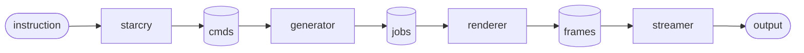

---
markdown:
  image_dir: /assets
  path: output.md
  ignore_from_front_matter: true
  absolute_image_path: false
---

# Main pipeline

| Item     | Type |       Description                           |
|-----------------|-------------------------|------------------------------------------|
| `instruction`     |   input  | Send by CLI or Web UI.|
| `starcry`         |   transformer  | Sets up all components and transforms instructions into commands. |
| `cmds`         |   queue  | Command that defines what needs to be generated (e.g., frame, video, raw image)|
| `generator`         |   transformer  | Evaluates the script related to the command, generates a job for rendering.|
| `jobs`         |   queue  | Job definition ready for rendering. |
| `renderer`         |   transformer  | Takes jobs from queue and renders them by delegating them to either local or remote workers. Places rendered frames in frames queue. |
| `frames`         |   queue  | Frames or partial frames(?) Double-check. |
| `streamer`         |   consumer  | Stiches together frames in the right sequence into video if needed, or outputs individual frames to disk as images. Or sends to Webserver?? Double-check. |
| `output`         |   output  | Either disk or Websockets. |

# CLI and UI

The command line interface can be used to render images, still frames, etc., basically everything.
The web-based UI is used for interactively working with scripts. At the time of writing you work with frames only in the UI, and the CLI has to be used to execute the final rendering of the video.

# Instructions and Commands

The pipeline has a few different types of entry points, instructions send to the engine.

| Instruction     |      Command            |    Description                           |
|-----------------|-------------------------|------------------------------------------|
| `get_image`     | `command_get_image`     | Fetches PNG image of specific frame. Used by remote rendering workers when communicating to main render and by UI `ImageHandler` for fetching server-rendered frames as a PNG image (for use-cases where further processing is not needed). |
| `get_shapes`    | `command_get_shapes`    | Used by UI `ShapesHandler`, in case local WASM rendering + display is used. |
| `get_objects`   | `command_get_objects`   | Used by UI `ObjectsHandler`, in case meta-information about objects is needed. |
| `get_bitmap`    | `command_get_bitmap`    | Used by UI `BitmapHandler`, in case local WASM display-only is used. |
| `get_video`     | `command_get_video`     | Used by CLI to render videos. |
| `get_raw_image` | `command_get_raw_image` | Used by CLI to render raw images in OpenEXR format. |
| `get_raw_video` | N/A                     | Not implemented, but this should output raw images for each frame. |

Clarifications:
* For each instruction type there is a dedicated command object.
* `main.cpp` or the web ui will call  `starcry::add_image_command`, which in turn instantiates the correct command and saves it in the `cmds` storage.
TODO: The plan is to refactor this part, as it's a little bit unclear how each instruction maps to which overload.
* TODO: `get_objects` meta-data should include something like max. distance travelled in frame.

# WebSocket Handlers

The Web UI communicates with various websockets, each dedicated to parsing certain type of messages. In hindsight a fewer simultaneous connections per client makes more sense to me, but at the time of writing I had not too much experience with websockets.

| Handler         | Input                   | Executes |    Output                                |
|-----------------|-------------------------|------------------|------------------------|
| `BitmapHandler` | `{filename: "foo.js", frame: 1 }` | `get_bitmap` + ViewPoint | `RGBA8888` binary data. (Viewpoint can also define `raw` and `preview`, `raw` will be written to disk as a side-effect.) |
| `ImageHandler` | `"foo.js 1"` | `get_bitmap` (raw=false, preview=false) | `PNG` image binary data in `std::string buffer`). |
| `ObjectsHandler` | `"foo.js 1"` | `get_objects` (raw=false, preview=false) | `JSON` data containing all objects in `std::string buffer`). |
| `ScriptHandler` | - | on connect | Sends active script filename to client. |
|  ...  | `"open foo.js"` | reads file (e.g., `input/foo.js`) contents | Javascript file contents as string |
| ... | `"list"` | reads input directory | `JSON` data containing all files with file name, size and modified. |
| `ShapesHandler` | `"foo.js 1"` | `get_shapes` (raw=false, preview=false) | `JSON` serialized `data::job` (which is input for the Renderer) in `std::string buffer`). |
| `StatsHandler` | - | - | Asynchronously server-side can send statistics to client (unidirectional). See `webserver::send_stats`. |
| `ViewPointHandler` | `{operation: "set", ...}` | Updates `data::viewpoint` struct in `starcry` class. | - |
| ... | `{operation: "get"}` | Retrieves `data::viewpoint` struct from `starcry` class. | `JSON` data containing `data::viewpoint` struct from `starcry` class. |

* Input and Output is fully asynchronous.
* TODO: `JSON` can be used more consistently, where in some places text messages are being used.

## Example: ObjectHandler - serialized objects

Put example here.

## Example: ViewPoint - serialized JSON

Put example here.

## Example: StatsHandler - serialized stats

Put example here.

# The generator

The generator is the most complicated part of the Starcry engine. It is single-threaded and tightly integrated with the V8 javascript engine. To avoid it being too much of a bottleneck the input for the generator is as declarative as possible, so that most of the heavy-lifting can be done in C++. Some more work can be done in the future to make the V8 integration lighter, but for now the integration is pretty heavy.

`generator::generate_frame`

A scene determines which objects are involved at any given frame.

Besides `objects` there are three buckets that contain instances of `objects`.
Initially all three will contain the same instances (copies!) of the same object.

When processing a frame, these are their purposes:

* `instances` - current frame instances
* `instances_next` - next frame instances
* `instances_intermediate` - intermediate values

The third bucket makes sense if you consider that a single frame may be split up in ten sub-frames. For a 25 FPS video, a single frame accounts for 40 milliseconds of video. With ten sub-frames, we advance 4 milliseconds ten times, to get smooth motion. In this case the intermediate instances keep track of current state changes on the instances. Once the ten sub frames are rendered correctly, they will be committed to instances_next.

Please note that while generating frames, there is logic that determines if objects moved too much, and we can abort, set finer granularity (more sub-frames) and start over. For this reason it's necessary to keep separate buckets, so we can always revert any state we've made.

## Script layout

| Component       |    Description                           |
|-----------------|------------------------------------------|
| `gradients`     | List of gradients that can be referenced by objects. |
| `textures`      | List of textures that can be referenced by objects. |
| `objects`       | List of objects, each object can have sub-objects.  |
| `video`         | Properties of the video, such as resolution, and other settings. |
| `preview`       | Optional overrides for properties defined in video, when rendering previews. |
| `scenes`        | Scenes define which objects get instantiated and when. |

### gradients

TODO

### textures

TODO

### objects

TODO

### video

TODO

### preview

TODO

### scenes

TODO

