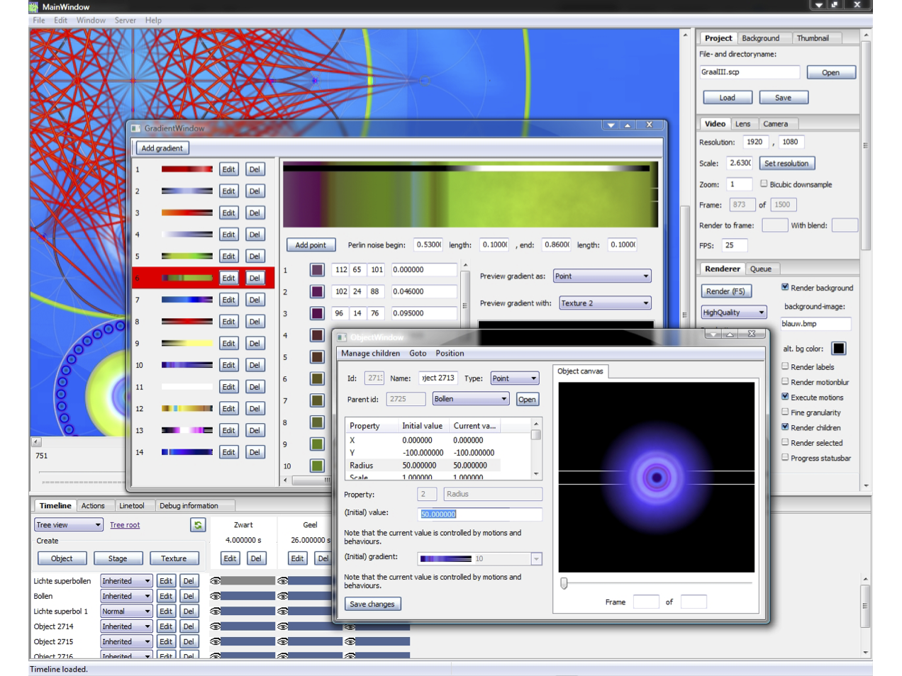

.. _web_ui:

The Web UI
==========

The GUI is not build yet, but it will be a web-based UI build on top of the starcry rendering engine.
It is intended to work on the script files, and therefor not have a different file format for saving projects.
Below is a screenshot from the old system which had a desktop UI written in wxWidgets.

